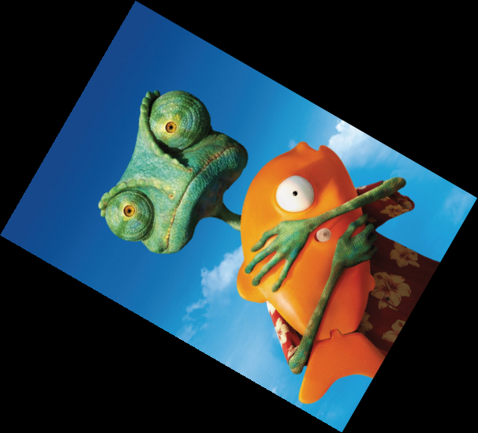
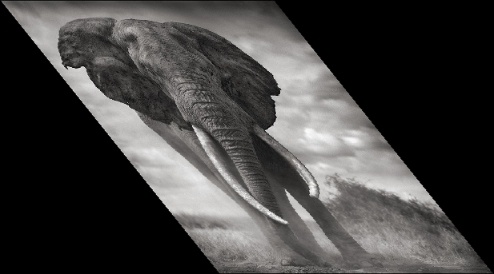

## Geometric Filters

#### Image Translation

`../bin/imagepro pics/eleph.png gs/tran.png -t 30 -40`

Grayscale   | Translation
:----------:|:-----------:
|

`../bin/imagepro pics/rango.png rgb/tran.png -t -60 35`

RGB Image    | Translation
:-----------:|:-----------:
|

#### Image Rotation

`../bin/imagepro pics/eleph.png gs/rot.png -r 45 1`

Grayscale   | Rotation
:----------:|:-----------:
|

`../bin/imagepro pics/rango.png rgb/rot.png -r 60 2`

RGB Image    | Rotation
:-----------:|:-----------:
|

#### Image Shear

`../bin/imagepro pics/eleph.png gs/shear_x.png -shear x 0.8 1`

Grayscale   | Horizontal Shear
:----------:|:---------------:
|

`../bin/imagepro pics/eleph.png gs/shear_y.png -shear y -0.2 1`

Grayscale   | Vertical Shear
:----------:|:---------------:
|

`../bin/imagepro pics/rango.png rgb/shear_x.png -shear x -0.5 2`

RGB Image    | Horizontal Shear
:-----------:|:---------------:
|

`../bin/imagepro pics/rango.png rgb/shear_y.png -shear y 0.4 2`

RGB Image    | Vertical Shear
:-----------:|:--------------:
|

#### Image Scale

`../bin/imagepro pics/eleph.png gs/scale.png -scale 1.5 0.75 1`

Grayscale   | Scaling
:----------:|:-----------:
|

`../bin/imagepro pics/rango.png rgb/scale.png -scale 0.65 1.2 2`

RGB Image    | Scaling
:-----------:|:------------:
|


## Visual Filters

#### Grayscale (BT.601)

`../bin/imagepro pics/rango.png rgb/gs.png -gs`

RGB Image    | Grayscale
:-----------:|:------------:
|

#### Grayscale (Mean)

`../bin/imagepro pics/rango.png rgb/gs_mean.png -gsm`

RGB Image    | Grayscale
:-----------:|:--------------:
|

#### Adjust Brightness

`../bin/imagepro pics/eleph.png gs/br.png -br 50`

Grayscale   | Brightness
:----------:|:-----------:
|

`../bin/imagepro pics/rango.png rgb/br.png -br 60`

RGB Image    | Brightness
:-----------:|:------------:
|

#### Adjust Contrast

`../bin/imagepro pics/eleph.png gs/cont.png -cont 30`

Grayscale   | Contrast
:----------:|:-----------:
|

`../bin/imagepro pics/rango.png rgb/cont.png -cont 45`

RGB Image    | Contrast
:-----------:|:------------:
|

#### Gamma Correction

`../bin/imagepro pics/eleph.png gs/gamma.png -g 3.0`

Grayscale   | Gamma
:----------:|:-----------:
|

`../bin/imagepro pics/rango.png rgb/gamma.png -g 3.0`

RGB Image    | Gamma
:-----------:|:------------:
|

#### Equalization

`../bin/imagepro pics/eleph-uneq.png gs/eq.png -eq`

Unequalized   | Equalized
:------------:|:-----------:
  |
|

`../bin/imagepro pics/rango-uneq.png rgb/eq.png -eq`

Unequalized    | Equalized
:-------------:|:------------:
  |
|

#### Color Inversion

`../bin/imagepro pics/eleph.png gs/inv.png -invert`

Grayscale   | Inversion
:----------:|:-----------:
|

`../bin/imagepro pics/rango.png rgb/inv.png -invert`

RGB Image    | Inversion
:-----------:|:------------:
|

#### Mean Blur

`../bin/imagepro pics/eleph.png gs/mean.png -mean`

Grayscale   | Mean Blur
:----------:|:-----------:
|

`../bin/imagepro pics/rango.png rgb/mean.png -mean`

RGB Image    | Mean Blur
:-----------:|:------------:
|

#### Gaussian Blur

`../bin/imagepro pics/eleph.png gs/gauss.png -gauss`

Grayscale   | Gaussian Blur
:----------:|:------------:
|

`../bin/imagepro pics/rango.png rgb/gauss.png -gauss`

RGB Image    | Gaussian Blur
:-----------:|:-------------:
|

#### Noise Removal (Median)

`../bin/imagepro pics/eleph-noise.png gs/noise.png -noise`

Noise       | Noise Removal
:----------:|:-----------:
|

`../bin/imagepro pics/rango-noise.png rgb/noise.png -noise`

Noise        | Noise Removal
:-----------:|:------------:
|

#### Sharpen Image (Laplace)

`../bin/imagepro pics/eleph.png gs/laplace.png -laplace`

Grayscale   | Laplace
:----------:|:-----------:
|

`../bin/imagepro pics/rango.png rgb/laplace.png -laplace`

RGB Image    | Laplace
:-----------:|:------------:
|

#### Emboss

`../bin/imagepro pics/eleph.png gs/emboss.png -emboss`

Grayscale   | Emboss
:----------:|:-----------:
|

`../bin/imagepro pics/rango.png rgb/emboss.png -emboss`

RGB Image    | Emboss
:-----------:|:------------:
|

#### Glow

`../bin/imagepro pics/eleph.png gs/glow.png -glow`

Grayscale   | Glow
:----------:|:-----------:
|

`../bin/imagepro pics/rango.png rgb/glow.png -glow`

RGB Image    | Glow
:-----------:|:------------:
|

#### Add RGB

`../bin/imagepro pics/eleph.png gs/add_rgb.png -rgb+ -10 0 10`

Grayscale   | Add RGB
:----------:|:-------------:
|

`../bin/imagepro pics/rango.png rgb/add_rgb.png -rgb+ -40 0 40`

RGB Image    | Add RGB
:-----------:|:--------------:
|

#### Multiply RGB

`../bin/imagepro pics/eleph.png gs/mul_rgb.png -rgb* 0.8 1.0 1.2`

Grayscale   | Multiply RGB
:----------:|:-------------:
|

`../bin/imagepro pics/rango.png rgb/mul_rgb.png -rgb* 0.6 1.0 1.4`

RGB Image    | Multiply RGB
:-----------:|:--------------:
|

#### Bluetone

`../bin/imagepro pics/eleph.png gs/blue.png -blue`

Grayscale   | Bluetone
:----------:|:-----------:
|

`../bin/imagepro pics/rango.png rgb/blue.png -blue`

RGB Image    | Bluetone
:-----------:|:------------:
|

#### Floyd Steinberg Dithering

`../bin/imagepro pics/eleph.png gs/floyd.png -floyd`

Grayscale   | Dithering
:----------:|:-----------:
|

`../bin/imagepro pics/rango.png rgb/floyd.png -floyd`

RGB Image    | Dithering
:-----------:|:------------:
|

#### Pixelize

`../bin/imagepro pics/eleph.png gs/pix.png -pix 10 15`

Grayscale   | Pixelize
:----------:|:-----------:
|

`../bin/imagepro pics/rango.png rgb/pix.png -pix 15 25`

RGB Image    | Pixelize
:-----------:|:------------:
|

#### Pixel Spreading

`../bin/imagepro pics/eleph.png gs/spread.png -spr 10 10 3919`

Grayscale   | Spread
:----------:|:-----------:
|

`../bin/imagepro pics/rango.png rgb/spread.png -spr 15 15 3919`

RGB Image    | Spread
:-----------:|:------------:
|


## Chained Filter Application

`../bin/imagepro pics/eleph.png gs/chain.png -g 0.5 -rgb* 1.5 1.5 1.5 -gs`

Grayscale   | Chained
:----------:|:-----------:
|

`../bin/imagepro pics/rango.png rgb/chain.png -cont -30 -glow -floyd -gauss`

RGB Image    | Chained
:-----------:|:------------:
|


## Dependencies

OpenCV2.3.1_install

```bash
$ sudo apt-get update
$ sudo apt-get install imagemagick
$ sudo apt-get install libcv-dev libhighgui-dev libcvaux-dev libopencv-dev
```

## References

- *Dreamland Fandasy Studios*: Programming
  - [Image Processing Algorithms Part 2: Error Diffusion](http://www.dfstudios.co.uk/articles/image-processing-algorithms-part-2/)
  - [Image Processing Algorithms Part 3: Greyscale Conversion](http://www.dfstudios.co.uk/articles/image-processing-algorithms-part-3/)
  - [Image Processing Algorithms Part 4: Brightness Adjustment](http://www.dfstudios.co.uk/articles/image-processing-algorithms-part-4/)
  - [Image Processing Algorithms Part 5: Contrast Adjustment](http://www.dfstudios.co.uk/articles/image-processing-algorithms-part-5/)
  - [Image Processing Algorithms Part 6: Gamma Correction](http://www.dfstudios.co.uk/articles/image-processing-algorithms-part-6/)

- *Procesamiento de Imagenes y Vision por Computador* (Gines Garcia Mateos)
  - [Tema 1. Adquisición y representación de imágenes.](http://dis.um.es/~ginesgm/files/doc/pav/tema1.pdf)
  - [Tema 2. Procesamiento global de imágenes.](http://dis.um.es/~ginesgm/files/doc/pav/tema2.pdf)
  - [Tema 3. Filtros y transformaciones locales.](http://dis.um.es/~ginesgm/files/doc/pav/tema3.pdf)
  - [Tema 4. Transformaciones geométricas.](http://dis.um.es/~ginesgm/files/doc/pav/tema4.pdf)
  - [Tema 5. Espacios de color y el dominio frecuencial.](http://dis.um.es/~ginesgm/files/doc/pav/tema5.pdf)
  - [Tema 6. Análisis de imágenes.](http://dis.um.es/~ginesgm/files/doc/pav/tema6.pdf)

- [*Practical PHP.* Chapter 11](http://www.tuxradar.com/practicalphp/11/0/0)

- [*RoboRealm vision for machines.*](http://www.roborealm.com/help/Convolution.php)

- [GIMP Documentation. Chapter 16 *Filters*](http://docs.gimp.org/en/filters.html)

- [JHLabs Java Image Processing.](http://www.jhlabs.com/ip/filters/)

- [Tech-Algorithm. Algorithm and Programming.](http://tech-algorithm.com/articles/boxfiltering/)

- [*Blurring the Line.* Jason Waltman.](http://www.jasonwaltman.com/thesis/introduction.html)

- [Lode's Computer Graphics Tutorial.](http://lodev.org/cgtutor/filtering.html)

- [Floyd-Steinberg Dithering. Stephen M. Omohundro.](omohundro.files.wordpress.com/2009/03/omohundro90_floyd_steinberg_dithering.pdf)
