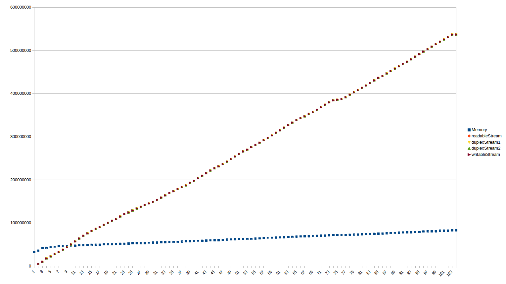
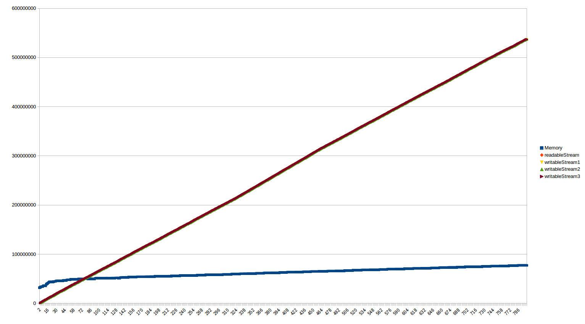

# Stream usage example

## Overview

- Streams are a great way to operate in Node.
- They are memory efficient because they let you handle data and in chunks.
- They are CPU efficient because they let you handle data  asynchronously.
- The downside of streams is that they are very complex to reason about.

## Hash calculator example

- Let's suppose we want to implement a function to calculate the SHA-1 and MD5 of a file.
- The straightforward approach is implemented in [hashCalculator/getHashSync()](tests/hashCalculator.js#L5-L11).
  - It is a synchronous implementation.
  - It reads the whole file in memory at once.
- This can be optimized by implementing it async as in [hashCalculator/getHash()](tests/hashCalculator.js#L13-L24).
  - It is an asynchronous implementation.
  - It reads the file in chunks.
- But what if we wanted to have a function to "decorate" the file stream, such that it allows me to generate the hash but also allows me to process the stream for another operation like uploading the file? We could use Node `stream.PassThrough` and do an implementation like in [hashCalculator/getHashReadable()](tests/hashCalculator.js#L29-L43).
- You can see how to use all these implementations in [hashCalculator test file](tests/hashCalculator.test.js).

## Stream pipes

- The `pipe()` function of Streams is a very convenient way to implement different stream-processing methods independently.
- However, when used without caution, memory problems can arise.
- Yes, even though we are using streams, chaining streams together can produce memory problems.

### Chaining streams

- Suppose we have a readable stream and we want to process it in three different ways.
- A possible way to do this is by using the following processing schema:
  ```
  readableStream ----> duplexStream1 ----> duplexStream2 ----> writableStream
  ```
- The file [streamChain](tests/streamChain.js) shows an example.
- When running this example, we can see that (as shown in the following chart):
  - Memory of the program slowly increases but never surpasses 100 MB.
  - The `readableStream` is read at the same rate in which data is forwarded to `writableStream`.
  - All intermediate streams operate in unison and no memory problems are present.




### Chaining streams (delayed)

- Now suppose we have the same schema as before, but in this case the `writableStream` is a slow processing function (for instance, because it is an operation to upload to an upstream server).
- The file [streamChainWithDelay](tests/streamChainWithDelay.js) shows an example.
- When running this example, we can see that (as shown in the following chart):
  - The `readableStream` is read at a similar rate as the memory of the program grows.
  - Memory of the program grows as much as needed to buffer the whole file in memory.
  - Intermediate streams do not operate in unison.
  - What is going on?
    - The `duplexStream1` receives a chunk of data and forwards it almost immediately.
    - The `duplexStream2` receives a chunk of data but cannot forward it until `writableStream` is ready.
    - The `writableStream` slows down the stream chain, but because the `readableStream` is not awar of it, chunks of data are accumulated in between.
  - *Note:* I have only seen this problem when using `stream.PassThrough`. If the same example was implemented with `stream.Transform` all streams would coordinate themselves appropriately.

")

### Stream channels

- The best alternative to process a stream in different ways is to use "stream channels" instead of "stream chains".
- Using "stream channels" the schema ends up being different:
  ```
                 |----> writableStream1
  readableStream |----> writableStream2
                 |----> writableStream3
  ```
- In this case, because we no longer need to pipe data from an intermediate stream into another, we no longer need `stream.Duplex` streams.
- The file [streamChannels](tests/streamChannels.js) shows an example.
- When running this example, we can see that (as shown in the following chart):
  - Memory of the program slowly increases but never surpasses 100 MB.
  - The `readableStream` is read at the same rate in which data is forwarded to all `writableStream`s.
  - All streams operate in unison and no memory problems are present.



## Conclusions

- You can have memory problems when using streams.
- When processing streams in different ways, it is preferred to use "stream channels" instead of "stream chains".
- It is always necessary to understand the underlying stream schema of the application, and `stream.PassThrough` should be avoided in favor of `stream.Transform`.
