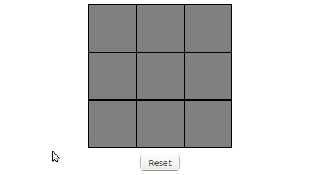

# Tic tac toe



Basic implementation of "Tic tac toe" game in `React.js`.

## Run locally

```bash
$ npm start
```

The `start` task will webpack-build the application and start an `express` server which you can access through:

```
http://0.0.0.0:3000/
```
